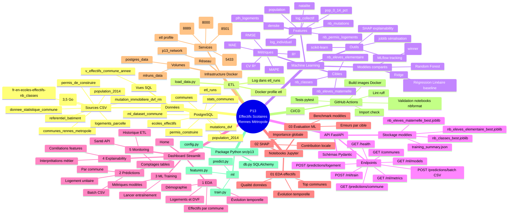

```mermaid
mindmap
  root((P13<br/>Effectifs Scolaires<br/>Rennes Métropole))

    Données
      Sources CSV
        communes_rennes_metropole
        donnee_statistique_commune
        mutation_immobiliere_dvf_rm
        fr-en-ecoles-effectifs-nb_classes
        population_2014
        permis_de_construire
        referentiel_batiment
        logements_parcelle
        Ficdep22 (3,5 Go)

      PostgreSQL
        communes
        stats_communes
        ecoles_effectifs
        mutations_dvf
        permis_construire
        population_2014
        ml_dataset_commune
        etl_runs

      Vues SQL
        v_effectifs_commune_annee

    ETL
      load_data.py
      Docker profile etl
      Log dans etl_runs

    Machine Learning
      Features
        population
        pop_0_14_pct
        natalite
        densite
        log_collectif
        log_individuel
        plh_logements
        nb_mutations
        nb_permis_logements

      Cibles
        nb_eleves_maternelle
        nb_eleves_elementaire
        nb_classes

      Modèles comparés
        Régression Linéaire baseline
        Ridge
        Random Forest
        Gradient Boosting (winner)

      Métriques
        RMSE
        MAE
        R²
        MAPE
        CV R²

      Outils
        scikit-learn
        MLflow tracking
        SHAP explainability
        joblib sérialisation

    API FastAPI
      Endpoints
        GET /health
        GET /communes
        POST /predictions/logement
        GET /predictions/commune
        POST /predictions/batch CSV
        POST /ml/train
        GET /ml/models
        GET /ml/metrics

      Schémas Pydantic

      Stockage modèles
        nb_eleves_maternelle_best.joblib
        nb_eleves_elementaire_best.joblib
        nb_classes_best.joblib
        training_summary.json

    Dashboard Streamlit
      Home

      1 EDA
        Effectifs par commune
        Évolution temporelle
        Démographie
        Logements et DVF

      2 Prédictions
        Logement unitaire
        Batch CSV
        Par commune

      3 ML Training
        Lancer entraînement
        Métriques modèles

      4 Explainability
        Corrélations features
        Interprétations métier

      5 Monitoring
        Historique ETL
        Santé API
        Comptages tables

    Notebooks Jupyter
      01 EDA effectifs
        Qualité données
        Évolution temporelle
        Top communes

      02 SHAP
        Importance globale
        Contribution locale

      03 Évaluation ML
        Benchmark modèles
        Erreurs par cible

    Infrastructure Docker
      Services
        postgres (5433)
        api (8000)
        streamlit (8501)
        jupyter (8889)
        etl profile

      Volumes
        postgres_data
        mlruns_data

      Réseau
        p13_network

    CI/CD
      GitHub Actions
        Lint ruff
        Import check
        Validation notebooks nbformat
        Tests pytest
        Build images Docker

    Package Python src/p13
      config.py
      db.py SQLAlchemy
      ml
        features.py
        train.py
        predict.py
```